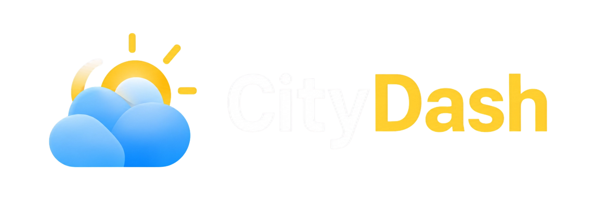

<p align="center">
  
</p>

<h1 align="center">CityDash</h1>

<p align="center">
  Um painel pessoal que reúne clima, horário, localização, notícias e anotações em um só lugar.
</p>

---

## 📋 Sobre o projeto

CityDash é um dashboard web pessoal construído com **HTML, CSS e JavaScript puro**, sem frameworks de front-end. A ideia central é oferecer, em uma única tela, as informações que alguém costuma checar separadamente ao longo do dia — clima da cidade, horário local, localização no mapa, principais notícias e uma lista de tarefas — tudo atualizado dinamicamente a partir de APIs públicas e gratuitas.

O projeto foi desenvolvido como exercício prático de integração com múltiplas APIs REST, manipulação de DOM, responsividade e organização de código em JavaScript puro.

## ⚙️ Funcionalidades

- 🔍 Busca de cidade com autocomplete (via geocoding)
- 📍 Detecção da localização atual do usuário
- 🌤️ Clima atual: temperatura, sensação térmica, umidade e vento
- 📅 Previsão do tempo para os próximos 5 dias
- 🕒 Relógio em tempo real, sincronizado com o fuso horário correto do local buscado
- 🗺️ Mapa interativo mostrando a localização selecionada
- 📰 Notícia em destaque do dia
- 💬 Frase motivacional diária
- ✅ Quadro de anotações (estilo kanban) com **drag and drop** entre "Pendentes" e "Concluídas"
- 📱 Layout totalmente responsivo (desktop, tablet e celular)

## 🔌 APIs utilizadas

| API | Para quê | Por que essa escolha |
|---|---|---|
| **[Open-Meteo](https://open-meteo.com/)** (Forecast + Geocoding) | Clima atual, previsão de 5 dias e busca de cidades | Gratuita, sem necessidade de chave de API, e já retorna o timezone correto de cada local na mesma resposta |
| **Geolocation API** (nativa do navegador) | Localização atual do usuário | API nativa do navegador, sem dependência externa nem chave |
| **[Leaflet.js](https://leafletjs.com/) + OpenStreetMap** | Mapa interativo da localização | Biblioteca leve, gratuita e sem necessidade de chave de API (diferente do Google Maps) |
| **[TheNewsAPI](https://www.thenewsapi.com/)** | Notícia em destaque do dia | CORS liberado no plano gratuito, permitindo chamada direta do navegador sem backend/proxy |
| **[API Ninjas](https://api-ninjas.com/)** (Quote of the Day) | Frase motivacional diária | Endpoint simples e gratuito para frase do dia |
| **Drag and Drop API** (nativa do navegador) | Mover anotações entre as colunas "Pendentes" e "Concluídas" | API nativa do HTML5, sem necessidade de bibliotecas externas de drag and drop |

## 🛠️ Tecnologias

- HTML5
- CSS3 (Flexbox, Grid, Media Queries)
- JavaScript (ES6+, `fetch`, `async/await`)
- [Bootstrap Icons](https://icons.getbootstrap.com/)
- [Leaflet.js](https://leafletjs.com/)

## 📁 Estrutura de pastas

```
CityDash/
├── index.html
├── css/
│   └── style.css
├── js/
│   └── script.js
└── assets/
    ├── img/
    └── icons/
```

## 🚀 Como rodar o projeto

1. Clone o repositório:
   ```bash
   git clone https://github.com/rianzitos/citydash.git
   ```
2. Gere suas próprias chaves gratuitas em [TheNewsAPI](https://www.thenewsapi.com/) e [API Ninjas](https://api-ninjas.com/), e substitua nos locais indicados em `js/script.js`
3. Abra o `index.html` diretamente no navegador, ou sirva com um servidor local, por exemplo:
   ```bash
   php -S localhost:8000
   ```

## ⚠️ Limitações conhecidas

- As notícias e a frase do dia dependem dos limites de requisição gratuita das respectivas APIs
- Os dados de clima/previsão/mapa/relógio só aparecem após uma busca de cidade ou uso da localização atual
- As anotações ficam apenas em memória — não há persistência entre recarregamentos de página

## 👤 Autor

Desenvolvido por **Rian**
GitHub: [@rianzitos](https://github.com/rianzitos)
Caso goste do projeto, considere dar uma estrela